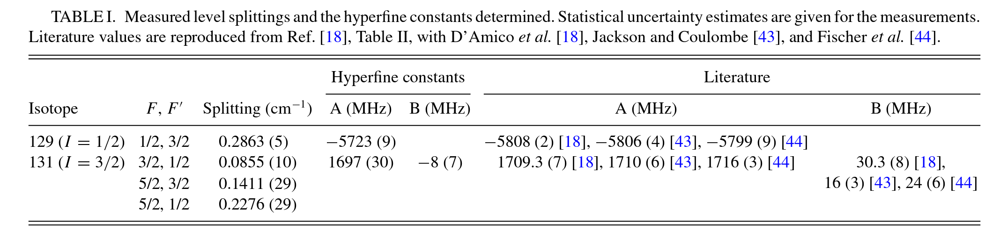

---
jupytext:
  formats: ipynb,md:myst
  text_representation:
    extension: .md
    format_name: myst
    format_version: 0.13
    jupytext_version: 1.14.7
kernelspec:
  display_name: Python 3 (ipykernel)
  language: python
  name: python3
---

# Basic fitting for hyperfine beat (stage 1 bootstrap)

From prior work and data:

- Forbes, R. et al. (2018) ‘Quantum-beat photoelectron-imaging spectroscopy of Xe in the VUV’, Physical Review A, 97(6), p. 063417. Available at: https://doi.org/10.1103/PhysRevA.97.063417. arXiv: http://arxiv.org/abs/1803.01081, Authorea (original HTML version): https://doi.org/10.22541/au.156045380.07795038
- Data (OSF): https://osf.io/ds8mk/
- [Quantum Metrology with Photoelectrons (Github repo)](https://github.com/phockett/Quantum-Metrology-with-Photoelectrons), particularly the [Alignment 3 notebook](https://github.com/phockett/Quantum-Metrology-with-Photoelectrons/blob/master/Alignment/Alignment-3.ipynb). Functions from this notebook have been incorporated in the current project, under `qbanalysis.hyperfine`.

+++

For basic fitting, try a stage 1 style bootstrap. In this case, set (arbitrary) parameters per final state for the probe, and fit these plus the hyperfine beat model parameters. This should allow for a match to a single set of hyperfine parameters for all observables.

- 14/06/24: basic fit for L=4/ROI-0 data working with Scipy. Next should add ionization model and use all states...
   - Xarray wrapper may be neater? See https://docs.xarray.dev/en/latest/generated/xarray.DataArray.curvefit.html#xarray.DataArray.curvefit
   - 16/06/24: A,B param determination with Scipy.least_squares working. Seems like overkill, but other methods not very flexible? Currently pass Xarray data for calcs, with wrappers for Scipy. Quite annoying.
   - TODO: try PD-based calc, should actually be easier in this case.

+++

## Setup fitting model

Follow the modelling notebook, but wrap functions for fitting.

New functions are in `qbanalysis.basic_fitting.py`.

+++

### Imports

```{code-cell} ipython3
# Load packages
# Main functions used herein from qbanalysis.hyperfine
from qbanalysis.hyperfine import *
import numpy as np
from epsproc.sphCalc import setBLMs

from pathlib import Path

dataPath = Path('/tmp/xe_analysis')
# dataTypes = ['BLMall', 'BLMerr', 'BLMerrCycle']   # Read these types, should just do dir scan here.

# # Read from HDF5/NetCDF files
# # TO FIX: this should be identical to loadFinalDataset(dataPath), but gives slightly different plots - possibly complex/real/abs confusion?
# dataDict = {}
# for item in dataTypes:
#     dataDict[item] = IO.readXarray(fileName=f'Xe_dataset_{item}.nc', filePath=dataPath.as_posix()).real
#     dataDict[item].name = item

# Read from raw data files
from qbanalysis.dataset import loadFinalDataset
dataDict = loadFinalDataset(dataPath)

# Use Pandas and load Xe local data (ODS)
# These values were detemermined from the experimental data as detailed in ref. [4].
from qbanalysis.dataset import loadXeProps
xeProps = loadXeProps()
```

### Init parameters & test

Here use `xeProps` to set and define fit paramters. Note in the original work the splittings were determined by FT of the data, and A, B parameters via Eqn. 2 therein.

TODO: may want to use lmfit here for more flexibility.

```{code-cell} ipython3
# Set splittings
fitParamsCol = 'Splitting/cm−1'
xePropsFit = xeProps.copy()

xeSplittings = xePropsFit[fitParamsCol].to_numpy()
```

```{code-cell} ipython3
# # Test beat model with changed params...
# xeSplittings = np.random.randn(4)
# xeSplittings
```

```{code-cell} ipython3
# xePropsFit[fitParamsCol] = 0.1*np.abs(xeSplittings)
# xePropsFit
```

```{code-cell} ipython3
# # OPTIONAL: Test beat model with changed params...

# # Set arb params
# xeSplittings = np.random.randn(4)
# xePropsFit[fitParamsCol] = 0.1*np.abs(xeSplittings)

# # Compute model with new params
# modelDict = computeModel(xePropsFit)
# modelDictSum, modelDA = computeModelSum(modelDict)

# # Plot model
# plotOpts = {'width':800}
# modelDA = stackModelToDA(modelDictSum)
# plotHyperfineModel(modelDA, **plotOpts).opts(title="Isotope comparison + sum")
```

## Run fits with Scipy Least Squares

Use the wrapper :py:func:`qbanalysis.basic_fitting.calcFitModel()` with `scipy.optimize.least_squares`. The wrapper uses `computeModelSum()` as above, and computes the residuals.

For the basic case, no ionization model is included, so this fit is only to see how well the form of the hyperfine beat can be matched to the  $K=4$ case for ROI 0, and how much the level splittings are modified from the previous case (determined by FT).

```{code-cell} ipython3
# Import functions
from qbanalysis.basic_fitting import *
import scipy

#*** Init params - either random or from previous best
# NOTE: this needs to be a 1D Numpy array.
# x0 = np.abs(np.random.random(4))  # Randomise inputs

# Seed with existing params - note this can't be Uncertainties objects
xePropsFit = xeProps.copy()
x0 = unumpy.nominal_values(xePropsFit[fitParamsCol].to_numpy())  # Test with previous vals

#*** Run a fit
fitOut = scipy.optimize.least_squares(calcBasicFitModel, x0, bounds = (0.01,0.5), verbose = 2,
                                      kwargs = {'xePropsFit':xePropsFit, 'dataDict':dataDict})
fitOut.success
```

```{code-cell} ipython3
# Using Scipy, the fit details are in fitOut, and results in fitOut.x
fitOut.x
```

```{code-cell} ipython3
fitOut
```

```{code-cell} ipython3
# Check results - run model again with best fits
xePropsFit, modelFit, modelFitSum, modelIn, dataIn, res = calcBasicFitModel(fitOut.x, xePropsFit, dataDict, fitFlag=False)

# Fitted model & components
# (plotHyperfineModel(modelFit['129Xe'], **plotOpts) * plotHyperfineModel(modelFit['131Xe'], **plotOpts) * plotHyperfineModel(modelFitSum, **plotOpts)).opts(title="Isotope comparison + sum")

# Compare fit results with dataset
from qbanalysis.plots import plotFinalDatasetBLMt
# plotFinalDatasetBLMt(**dataDict, **plotOpts) * plotHyperfineModel(modelFitSum, **plotOpts).select(K=2).opts(**plotOpts)
(plotHyperfineModel(modelFitSum, **plotOpts,).select(K=2).opts(**plotOpts) * plotFinalDatasetBLMt(**dataDict, **plotOpts).select(l=4)).opts(title="Fit (K=2) plus data (l=4)")
```

```{code-cell} ipython3
# Check new results vs. reference case...
compareResults(xeProps, xePropsFit)
```

Here we can see that - as expected - the fit is pretty good for the $l=4$, $ROI=0$ data. The fitted values are slightly different to the previous results (obtained via FT of the time-domain data).

+++

## Determine A & B parameters

To further compare these new splittings with the previous results and literature, the A & B hyperfine parameters can be determined.

From the measurements, the hyperfine coupling constants can be determined by fitting to the usual form (see, e.g., ref. \cite{D_Amico_1999}):
\begin{equation}
\Delta E_{(F,F-1)}=AF+\frac{3}{2}BF\left(\frac{F^{2}+\frac{1}{2}-J(J+1)-I(I+1)}{IJ(2J-1)(2I-1)}\right)
\end{equation}

Note, for $^{129}\rm{Xe}$, $\Delta E_{(F,F-1)}=AF$ only ($B=0$).

```{code-cell} ipython3
# Extract parameters from fit results (splittings)
# This again uses scipy.optimize.least_squares() under the hood.
xePropsFit = extractABParams(xePropsFit)
xePropsFit.style.set_caption("Updated results")
```

## Compare results with previous values & literature

+++

### Diffs from previous values

```{code-cell} ipython3
# Check new results vs. reference case...
# TODO: neater comparison!
display(compareResults(xeProps, xePropsFit, fitParamsCol="A/MHz").style.set_caption("Comparison: A/MHz"))
display(compareResults(xeProps, xePropsFit, fitParamsCol="B/MHz").style.set_caption("Comparison: B/MHz"))
```

### Check vs. literature values

+++

These values can be compared with the previous case (as above), and literature values, per Table 1 in the previous manuscript.

```{code-cell} ipython3
xePropsFit.droplevel(['I','F′','F'])[0:2][['A/MHz','B/MHz']]
```



+++

Here it is clear that the new values are much closer to the previous literature values, although all are slightly larger. In this case there is also no error propagation in the fitting, which will be tackled in the following notebook.

+++

## Versions

```{code-cell} ipython3
import scooby
scooby.Report(additional=['qbanalysis','pemtk','epsproc', 'holoviews', 'hvplot', 'xarray', 'matplotlib', 'bokeh'])
```

```{code-cell} ipython3
# # Check current Git commit for local ePSproc version
# from pathlib import Path
# !git -C {Path(qbanalysis.__file__).parent} branch
# !git -C {Path(qbanalysis.__file__).parent} log --format="%H" -n 1
```

```{code-cell} ipython3
# # Check current remote commits
# !git ls-remote --heads https://github.com/phockett/qbanalysis
```

```{code-cell} ipython3
# Check current Git commit for local code version
import qbanalysis
!git -C {Path(qbanalysis.__file__).parent} branch
!git -C {Path(qbanalysis.__file__).parent} log --format="%H" -n 1
```

```{code-cell} ipython3
# Check current remote commits
!git ls-remote --heads https://github.com/phockett/Quantum-Beat_Photoelectron-Imaging_Spectroscopy_of_Xe_in_the_VUV
```
