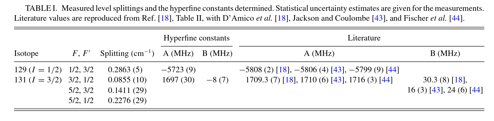

---
jupytext:
  formats: ipynb,md:myst
  text_representation:
    extension: .md
    format_name: myst
    format_version: 0.13
    jupytext_version: 1.14.7
kernelspec:
  display_name: Python 3 (ipykernel)
  language: python
  name: python3
---

+++ {"tags": ["remove-cell"]}

- 19/06/24 REDUX version
   Just pulling good bit from previous version!
   
TODO:

- Fit testing and uncertainties, see dev notebook for latter case (not currently giving output...)
    - With s2 fixed, get std. error output (this is dummy param and leads to inf std. errors case).
    - See version with additional confidence interval code for more details, `notebooks/4_modelling/4.03-redux_hyperfine_beats_adv_fitting_190624-CI-test.ipynb`.
    

- FIX SPELLCHECKER, see https://github.com/jupyterlab-contrib/spellchecker
   - Tested online dict, didn't seem to fix things, but maybe need a restart?
   - Could also just try a rebuild, since this also seemed to be a Jupyter version issue (although may also be that some install stages were missing in current Docker build...?) May also be a built-in one now...?

+++

(page:advanced-fitting)=
# Advanced fitting for hyperfine beat (stage 1 bootstrap)

For advanced fitting, try a stage 1 style bootstrap. In this case, options are:

- "basic" ignore the photoionization dynamics and just try fitting the beat to the $l=4$, ROI=0 case, since it is already pretty close and may be assumed to be directly mapped here. See {ref}`page:basic-fitting`.
- "advanced" set (arbitrary) parameters per final state for the probe, and fit these plus the hyperfine beat model parameters. This should allow for a match to a single set of hyperfine parameters for all observables, and fulfil the stage 1 bootstrap criteria. (This page.)

---

From prior work and data:

- Forbes, R. et al. (2018) ‘Quantum-beat photoelectron-imaging spectroscopy of Xe in the VUV’, Physical Review A, 97(6), p. 063417. Available at: https://doi.org/10.1103/PhysRevA.97.063417. arXiv: http://arxiv.org/abs/1803.01081, Authorea (original HTML version): https://doi.org/10.22541/au.156045380.07795038
- Data (OSF): https://osf.io/ds8mk/
- [Quantum Metrology with Photoelectrons (Github repo)](https://github.com/phockett/Quantum-Metrology-with-Photoelectrons), particularly the [Alignment 3 notebook](https://github.com/phockett/Quantum-Metrology-with-Photoelectrons/blob/master/Alignment/Alignment-3.ipynb). Functions from this notebook have been incorporated in the current project, under `qbanalysis.hyperfine`.

+++

## Advanced model & fitting methodology

### Model improvements

In order to more fully describe the data, make the following additions to the basic model:

1. Allow for signal decay with exponential decay and lifetimes per isotope. This can be added to the hyperfine wavepacket ({eq}`TKQ-wavepacket`) as:

$$
\begin{equation}
\langle T(J;t,\tau_I)_{KQ}^{\dagger} \rangle =G(J;t)_{K}\langle T(J)_{KQ}^{\dagger}\rangle \exp^{(-t/\tau_{I})}
\end{equation}
$$ (TKQ-wavepacket-decay)

Where $\tau_I$ is the lifetime for each isotope/nuclear spin state.

2. Add a phenomenological ionization model. In this case, simply allow for a magnitude and offset per channel (i.e. per $l$, $ROI$ in the dataset). In this case, the signal per channel can be described as the product of the wavepacket and ionization model:

$$
S(l,t,ROI) = [A_{l,ROI} * \sum_{I}\langle T(J;t,\tau_I)_{KQ}^{\dagger} \rangle] + O_{l,ROI}
$$  (S-ltI)

In this model the amplitudes $A$ and offsets $O$ can be +ve or -ve, but no other phase terms are included, and they are assumed to be the same for each isotope (but not ionization channel). Note that the underlying wavepacket is effectively global, aside from the decay constants, as indicated above.


### Fitting changes

For handling larger models and fitting, [lmfit](https://lmfit.github.io) can be used. This provides a method for setting and addressing parameters by name (with class and dictionary syntax), and is therefore easier to use and debug as compared the the base Scipy routines (at the cost of a slightly more elaborate setup and configuration). Note, however, that Scipy routines are still used on the backend, but lmfit provides a convenient  wrapper and ancillary functionality.

+++

## Setup fitting model

Follow the modelling notebook ({ref}`page:hyperfine-beat-model`), but wrap functions for fitting, plus updates to use advanced model + lmfit.

New functions are in `qbanalysis.adv_fitting.py`.

+++

### Imports

```{code-cell} ipython3
# Load packages
# Main functions used herein from qbanalysis.hyperfine
from qbanalysis.hyperfine import *
import numpy as np
from epsproc.sphCalc import setBLMs

from pathlib import Path

dataPath = Path('/tmp/xe_analysis')
# dataTypes = ['BLMall', 'BLMerr', 'BLMerrCycle']   # Read these types, should just do dir scan here.

# # Read from HDF5/NetCDF files
# # TO FIX: this should be identical to loadFinalDataset(dataPath), but gives slightly different plots - possibly complex/real/abs confusion?
# dataDict = {}
# for item in dataTypes:
#     dataDict[item] = IO.readXarray(fileName=f'Xe_dataset_{item}.nc', filePath=dataPath.as_posix()).real
#     dataDict[item].name = item

# Read from raw data files
from qbanalysis.dataset import loadFinalDataset
dataDict = loadFinalDataset(dataPath)

# Use Pandas and load Xe local data (ODS)
# These values were detemermined from the experimental data as detailed in ref. [4].
from qbanalysis.dataset import loadXeProps
xeProps = loadXeProps()
```

```{code-cell} ipython3
# v2 pkg
from qbanalysis.adv_fitting import * 
```

```{code-cell} ipython3
:tags: [hide-cell]

# Hide future warnings from Xarray concat for fitting on some platforms
import warnings
# warnings.filterwarnings('ignore')  # ALL WARNINGS
# warnings.filterwarnings('ignore', category=DeprecationWarning)
warnings.filterwarnings('ignore', category=FutureWarning)
```

### Init parameters

Here the defaults can be used initially, and later modified as desired.

Here: 

- the basic model parameters for the level splittings are `s0, s1...`, 
- the lifetimes per isotope are `tau129` and `tau131`
- $A_{l,I}$, $O_{l,I}$ are denoted `l<N>_<param>_<ROI>`, for $N=2,4$, `<param>=amp,off` and `<ROI>=0,1` to match the channels in the experimental data.

```{code-cell} ipython3
# Create model parameters
params = initParams(xeProps)

# Display default repr
params
```

```{code-cell} ipython3
# Parameter values can be modified with params.set()
params.set(l2_amp_0=1)

# Or use dict syntax to chnage other properties
params.set(s1={'max':0.5})
params.set(s2={'vary':False})  # Skip this parameter as it is not actually used


# Properties can be checked by name or .get
print(params['l2_amp_0'])
print(params.get('s1'))
```

## Set data and test model

```{code-cell} ipython3
# Set data for l=2,4, and uncertainties
dataIn = dataDict['BLMall'].unstack().sel({'l':[2,4]}).copy()
dataUn = dataDict['BLMerr'].unstack().sel({'l':[2,4]}).copy()  # Main data has uncertainties separately currently
```

```{code-cell} ipython3
# Compute advanced model...
calcDict = calcAdvFitModel(params, xePropsFit=xeProps, dataDict=dataDict)

# Note this returns various stages of the calculation in the output dict
calcDict.keys()
```

```{code-cell} ipython3
# Plot original (basic) model, and model with decay
plotHyperfineModel(calcDict['modelDA']) * plotHyperfineModel(calcDict['decay'])
```

```{code-cell} ipython3
# Plot ionization model - this now has channels to match experimental case (l,ROI)
plotHyperfineModel(calcDict['ionization'].squeeze(),overlay=['l'])
```

## Fitting with the advanced model

Here use `qbanalysis.adv_fitting.calcAdvlmfit()` - this wraps the above model + residual calculations for lmfit.

```{code-cell} ipython3
mini = lmfit.Minimizer(calcAdvlmfit, params, fcn_kws={'xePropsFit':xeProps, 'dataDict':dataDict})  
result = mini.minimize()
```

```{code-cell} ipython3
# Check final output and plot vs. data
# from qbanalysis.plots import plotFinalDatasetBLMt
# plotOpts = {'width':800}
# calcDict = calcAdvFitModel(out.params, xePropsFit=xeProps, dataDict=dataDict)
# plotHyperfineModel(calcDict['ionization'],overlay=['ROI']) * plotFinalDatasetBLMt(**dataDict, **plotOpts)


# PLOT TESTING...
# TODO: add labels and fix ledgend in layout
from qbanalysis.plots import plotFinalDatasetBLMt
plotOpts = {'width':800}
calcDict = calcAdvFitModel(result.params, xePropsFit=xeProps, dataDict=dataDict)
# plotHyperfineModel(calcDict['ionization'],overlay=['ROI']).layout('l')

# To fix layout issues, treat l separately...
l2 = (plotFinalDatasetBLMt(**dataDict) * plotHyperfineModel(calcDict['ionization'],overlay=['ROI'])).select(l=2)
l4 = (plotFinalDatasetBLMt(**dataDict) * plotHyperfineModel(calcDict['ionization'],overlay=['ROI'])).select(l=4)

(l2.overlay('l').opts(title="l2", **plotOpts) + l4.overlay('l').opts(title="l4", **plotOpts)).cols(1)
```

```{code-cell} ipython3
# Check final residuals
res, dataDS, modelDS = residualAdv(calcDict['ionization'].squeeze(), dataIn.squeeze(), dataUn = dataUn)
plotHyperfineModel(res,overlay=['l'], **plotOpts)
```

```{code-cell} ipython3
# Final fit parameters
# result.params.pretty_print()
result.params
```

Of note here is that the uncertainties are generally quite small, with the exception of the $\tau$ parameters. In the current case - fitting only $\beta>0$ - these parameters should only be relevant/necessary if (a) there is significant signal decay such that S/N becomes an issue (as in the $(L=2,ROI=1)$ channel), (b) there is a loss in coherence of the wavepacket. This is becuase the data is already normalised by yield, so any population or signal decay is removed. Here it seems that (b) is likely to be long, on the order of 4 ns, with a large uncertainty, which should be comparable to the state lifetimes.

TODO: try basic fitting for yields ($L=0$) to chek $\tau$ values, although there are likely to be other issues there.

+++

## Check hyperfine A, B params from the updated model

```{code-cell} ipython3
from qbanalysis.basic_fitting import extractABParams
xePropsFit =extractABParams(calcDict['xePropsFit'])
xePropsFit.style.set_caption("Updated results")
```

```{code-cell} ipython3
xePropsFit.droplevel(['I','F′','F'])[0:2][['A/MHz','B/MHz']]
```



+++

## Check uncertainties

Reformat lmfit params to ufloat or [value,std] Dataframe.

Note this also resets s2 = s3-s1, since this is a derived/redundant parameter, which should show the correct uncertainty.

TODO:

- Prop t uncertainties.
- Prop uncertainties for Xe131 A/B params fit.

```{code-cell} ipython3
paramsUDict, paramsDF = pdDFParamsUncertainties(result.params)

paramsDF
```

```{code-cell} ipython3
paramsDF.loc['s2'] = paramsDF.loc['s3']-paramsDF.loc['s1']
```

```{code-cell} ipython3
# Recalc model with uncertainties & plot...
# NOTE: currently doesn't include uncertainties on t-coord.
# TODO: add labels and fix ledgend in layout
from qbanalysis.plots import plotFinalDatasetBLMt
plotOpts = {'width':800}
calcDict = calcAdvFitModel(paramsUDict, xePropsFit=xeProps, dataDict=dataDict)
# plotHyperfineModel(calcDict['ionization'],overlay=['ROI']).layout('l')

# To fix layout issues, treat l separately...
l2 = (plotFinalDatasetBLMt(**dataDict) * plotHyperfineModel(calcDict['ionization'],overlay=['ROI'])).select(l=2)
l4 = (plotFinalDatasetBLMt(**dataDict) * plotHyperfineModel(calcDict['ionization'],overlay=['ROI'])).select(l=4)

(l2.overlay('l').opts(title="l2", **plotOpts) + l4.overlay('l').opts(title="l4", **plotOpts)).cols(1)
```

```{code-cell} ipython3
# A/B with uncertainties...
xePropsFit =extractABParams(calcDict['xePropsFit'])
xePropsFit.style.set_caption("Updated results")
```

```{code-cell} ipython3
xePropsFit.droplevel(['I','F′','F'])[0:2][['A/MHz','B/MHz']]
```

```{code-cell} ipython3
# Save results to file for future use (using PD.to_hdf)

# Set timestamp
import datetime
now = datetime.datetime.now()
timeStamp = now.strftime("%d-%m-%y_%H-%M-%S")

# Write to file
# fileOut = f'../../data/processed/xeAdvFit_{timeStamp}.h5'  # Use main data dir?
fileOut = f'../../dataLocal/xeAdvFit_{timeStamp}.h5'  # Use dataLocal for achive cases
xePropsFit.to_hdf(fileOut, key='xePropsFit')
paramsDF.to_hdf(fileOut, key='xeParamsFit')
```

```{code-cell} ipython3
# Test file read OK
# pd.read_hdf(fileOut,key='xePropsFit')
# pd.read_hdf(fileOut,key='xeParams')
```

## Versions

```{code-cell} ipython3
import scooby
scooby.Report(additional=['qbanalysis','pemtk','epsproc', 'holoviews', 'hvplot', 'xarray', 'matplotlib', 'bokeh'])
```

```{code-cell} ipython3
# # Check current Git commit for local ePSproc version
# from pathlib import Path
# !git -C {Path(qbanalysis.__file__).parent} branch
# !git -C {Path(qbanalysis.__file__).parent} log --format="%H" -n 1
```

```{code-cell} ipython3
# # Check current remote commits
# !git ls-remote --heads https://github.com/phockett/qbanalysis
```

```{code-cell} ipython3
# Check current Git commit for local code version
import qbanalysis
!git -C {Path(qbanalysis.__file__).parent} branch
!git -C {Path(qbanalysis.__file__).parent} log --format="%H" -n 1
```

```{code-cell} ipython3
# Check current remote commits
!git ls-remote --heads https://github.com/phockett/Quantum-Beat_Photoelectron-Imaging_Spectroscopy_of_Xe_in_the_VUV
```
